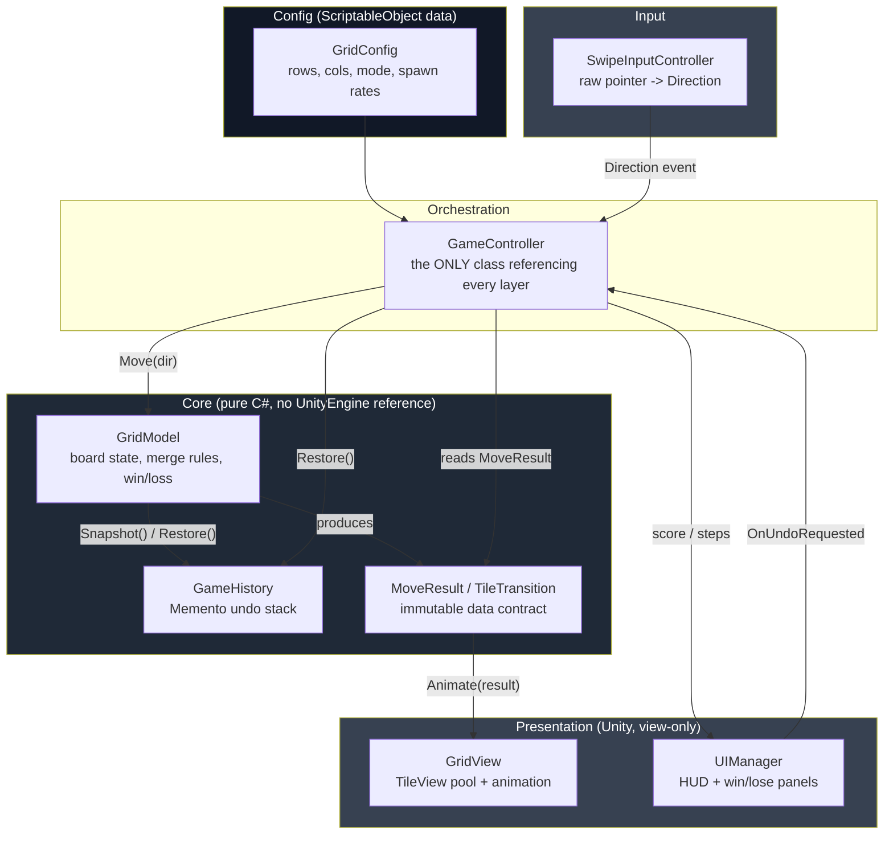
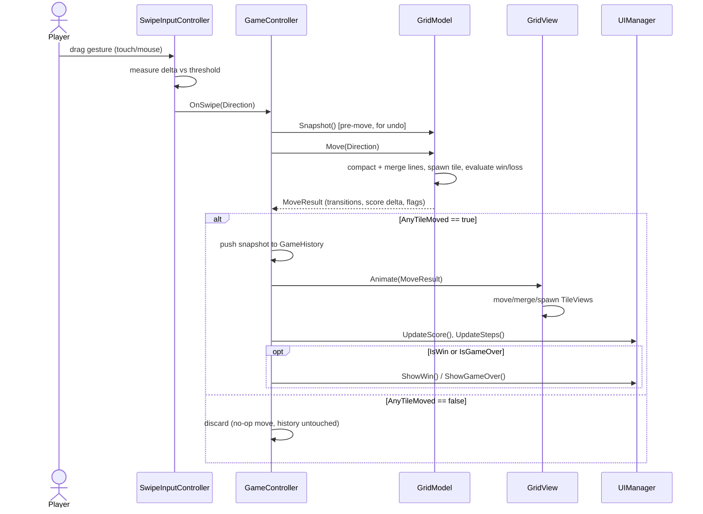

# Grid Puzzle Challenge

A grid-merge puzzle (2048-style rules) built in Unity, engineered around a strict
separation between logical state and rendering.

## Features

- **N × M grid simulation** — size configurable via `GridConfig` (default 4×4).
- **Swipe-based input** — `SwipeInputController` tracks a touch/mouse drag vector and
  emits a discrete `Direction` (Up/Down/Left/Right) once a threshold is crossed.
- **Deterministic undo** — every move snapshots pre-move state into a depth-capped
  history stack (Memento pattern) before mutating the board.
- **Two game modes** — `Endless` (play until no merges remain) and `StepLimited`
  (fixed move budget, hit a target score to win) — satisfying the "rigid step
  framework" requirement.
- **Gameplay hook — Wildcard Tile**: a rare (`*`) tile that merges with *any*
  adjacent value instead of only matching ones, giving players a controllable
  "joker" to break bad board states.
- **Clean HUD**: live score, moves-remaining (in StepLimited mode), and explicit
  win/lose panels.
- **Unit-testable core**: `GridPuzzle.Core` has zero `UnityEngine` dependency, so
  merge/undo/win logic is covered by plain NUnit tests (`Assets/Tests/EditMode`).

## System Architecture Map



**Decoupling rule enforced:** `GridModel`, `GameHistory`, and `MoveResult` never
import `UnityEngine`. `GridView` and `UIManager` never import `GridModel` — they only
ever see the `MoveResult` data contract or primitive values (`int score`, `bool`
flags) handed to them by `GameController`. `GameController` is intentionally the one
class allowed to know about all layers — that's where "orchestration" lives, so no
other class needs to.

## Functional Code Flow



**Data pipeline, as required:**
`User Gesture → Input Controller → Grid Matrix Update → UI Rendering Framework`
maps directly to `SwipeInputController → GameController.HandleSwipe → GridModel.Move
→ GridView.Animate / UIManager.Update*`.

## Design pattern rationale

| Concern | Pattern | Why |
|---|---|---|
| Undo/redo | **Memento** (`GridSnapshot` + `GameHistory`) | Board is small (≤ ~64 cells typical), so a depth-capped deep copy is simpler and less bug-prone than diff/command replay, while still bounding memory. |
| Model → View communication | **Observer** (C# events: `OnSwipe`, `OnUndoRequested`) + **explicit data contract** (`MoveResult`) | View never polls or reaches into Model; Model never references View types. |
| Move algorithm | Single generic **line compaction** routine reused for all 4 directions | Avoids 4 near-duplicate implementations; one bug surface instead of four. |
| Tuning values | **ScriptableObject config** (`GridConfig`) | Grid size / win value / spawn chance / undo depth are data, not hardcoded constants — designers iterate without touching code. |
| Orchestration | Thin **Controller** (`GameController`) | Only class permitted to reference Input + Core + Presentation; keeps every other class's dependency graph small and independently testable. |

### On algorithmic efficiency

- `Move()` is `O(Rows × Cols)` — each cell is visited once during line
  compaction, once during spawn scan.
- `CheckGameOverCondition()` is `O(Rows × Cols)` — it inspects adjacency directly
  rather than simulating all four possible moves on a cloned board, which would
  cost 4× as much for no benefit.
- Undo cost is `O(Rows × Cols)` per snapshot, bounded by `maxUndoDepth` so total
  history memory is `O(Rows × Cols × maxUndoDepth)` — a fixed ceiling, not a leak.

## Project layout

```
Assets/
  Scripts/
    Core/            # GridModel, GameHistory, Tile, MoveResult, GridSnapshot, Direction, GameMode
    Config/          # GridConfig (ScriptableObject)
    Input/           # SwipeInputController
    Presentation/    # GridView, TileView, UIManager
    GameController.cs
  Tests/EditMode/    # NUnit tests against Core only
```

## Play in Editor
You can play the game in editor by pressing the play button in top center.


## Running tests

`Window → General → Test Runner → EditMode → Run All`. All tests run without
entering Play Mode since `GridModel` has no engine dependency.
